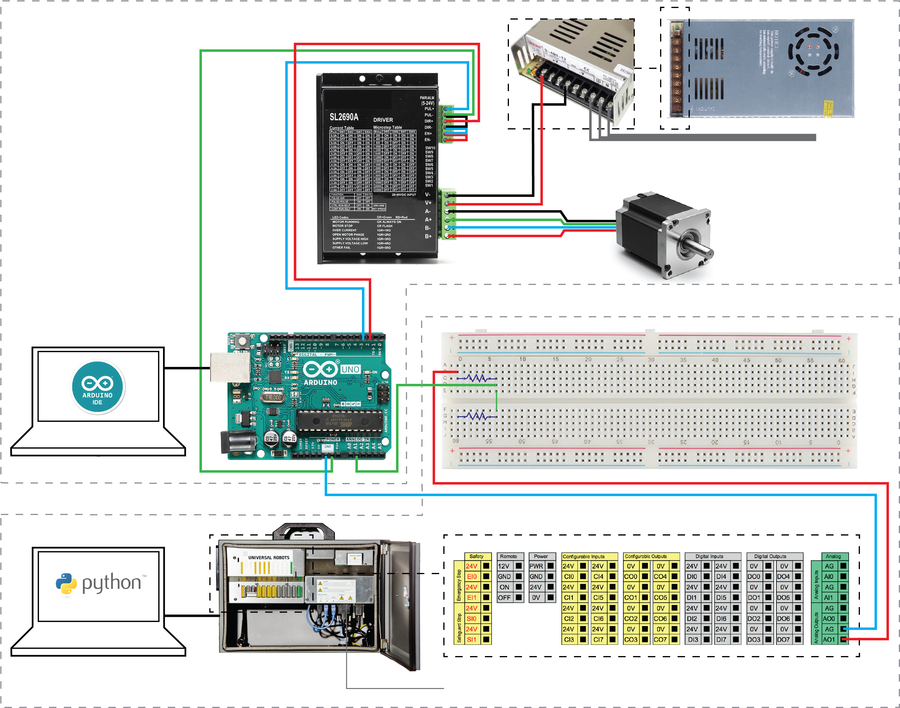
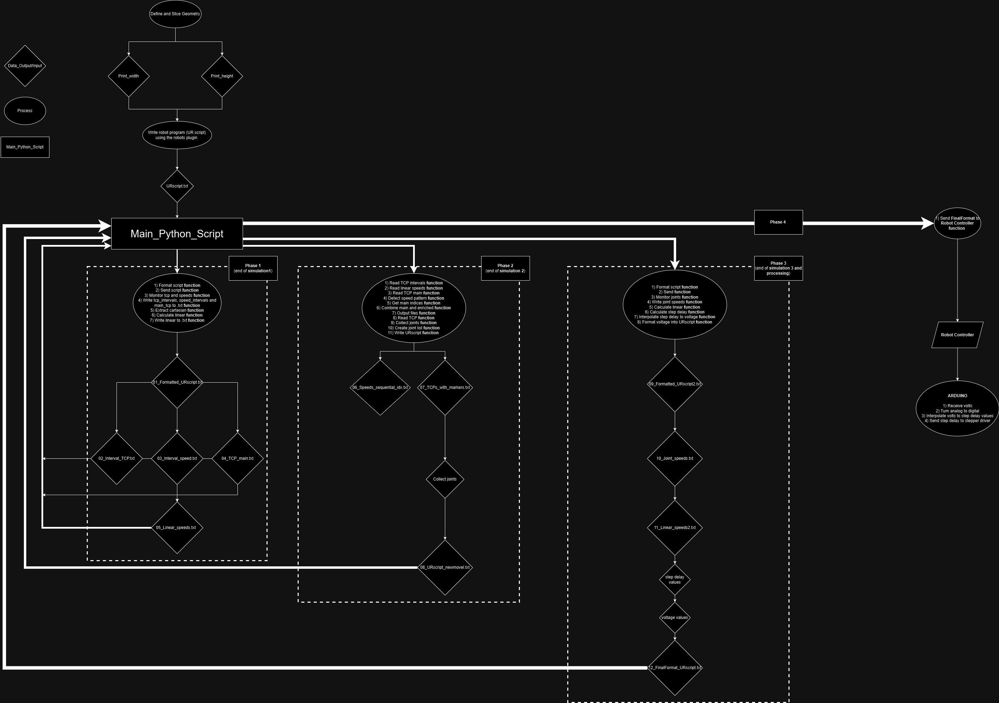

# RoboPops

# RoboFlow: Synchronized Extrusion for Robotic Speed Variations in 3D Printing

## Introduction

**RoboFlow** is an algorithm designed to synchronize extrusion rates with the speed variations of a robotic arm during 3D printing. The core objective is to monitor changes and deviations in robotic speeds through multiple simulations and calculate appropriate voltage values representing these changes. These voltage values are then sent through the robot controller to an Arduino, which interprets them to control an extruder or motor-auger system accordingly.

This process is not executed in real-time; instead, it involves several calculations performed through running simulations, collecting data, and processing that data. By the end of these calculations, we obtain predefined values that are used for the actual printing operation.

---

## Table of Contents

- [Prerequisites](#prerequisites)
- [Workflow Overview](#workflow-overview)
  - [Flowchart](#flowchart)
  - [Preparation](#preparation)
  - [Phase 1: Initial Data Formatting and Simulation](#phase-1-initial-data-formatting-and-simulation)
  - [Phase 2: Data Refinement and Joint Data Collection](#phase-2-data-refinement-and-joint-data-collection)
  - [Phase 3: Final Processing and Voltage Calculation](#phase-3-final-processing-and-voltage-calculation)
- [Function Details](#function-details)
- [Generated Files](#generated-files)
- [Usage Instructions](#usage-instructions)
- [Contributing](#contributing)
- [License](#license)
- [Acknowledgments](#acknowledgments)

---

## Prerequisites

- **Software:**
  - Rhino 3D with Grasshopper plugin (for geometry definition and kinematic modeling)
  - Robots plugin for Grasshopper (or an equivalent tool that can create kinematic models)
  - VMware for simulating the Polyscope control panel of Universal Robots
  - Python 
  - rtde library
  - numpy library
- **Hardware:**
  - Universal Robots robotic arm and controller (not needed for simulations)
  - Arduino (for interpreting voltage signals to control the extruder/motor-auger system)
  - stepper driver
  - stepper motor
  - extruder 
  - power supply
- **Hardware Setup:**

---

## Workflow Overview

## Flowchart 

### Preparation

Before starting the main phases of the algorithm, you need to:

1. **Define Geometry and Slice Manually:**
   - Use Grasshopper to model the desired 3D geometry.
   - Manually slice the geometry to set custom parameters for the toolpath.

2. **Create Kinematic Model:**
   - Utilize the Robots plugin (or another tool) in Grasshopper to simulate the robotic arm following the sliced geometry.

3. **Export URScript:**
   - Use a Python script within Grasshopper to extract and automate the export of the URScript (Universal Robots script) to a specified directory.

*Note: These preparation steps are essential but are not considered part of the algorithm's main phases. This algorithm can also be tested with a URscript.txt that we provide*

### Phase 1: Initial Data Formatting and Simulation

**Objective:** Format the output from Grasshopper and simulate the robotic motion to collect initial data.

1. **Format Script Function:**
   - Format the URScript output from Grasshopper for compatibility with the robot controller.

2. **Send Script Function:**
   - Send the formatted URScript to the robot controller in simulation mode.

3. **Monitor TCP and Speeds Function:**
   - Monitor the Tool Center Point (TCP) positions and speed data during simulation.

4. **Write TCP Intervals, Speed Intervals, and Main TCP to .txt Function:**
   - Write the collected TCP intervals, speed intervals, and main TCP data to text files:
     - `01_Formatted_URscript.txt`
     - `02_Interval_TCP.txt`
     - `03_Interval_speed.txt`
     - `04_TCP_main.txt`

5. **Extract Cartesian Function:**
   - Extract Cartesian coordinates from the TCP data.

6. **Calculate Linear Function:**
   - Calculate linear speeds based on the Cartesian coordinates.

7. **Write Linear to .txt Function:**
   - Write the calculated linear speeds to `05_Linear_speeds.txt`.

### Phase 2: Data Refinement and Joint Data Collection

**Objective:** Detect speed patterns and collect joint data for accurate motion planning.

1. **Read TCP Intervals Function:**
   - Read `02_Interval_TCP.txt`.

2. **Read Linear Speeds Function:**
   - Read `05_Linear_speeds.txt`.

3. **Read TCP Main Function:**
   - Read `04_TCP_main.txt`.

4. **Detect Speed Pattern Function:**
   - Analyze the speed data to detect patterns or deviations.

5. **Get Main Indices Function:**
   - Identify key indices corresponding to significant speed changes.

6. **Combine Main and Enriched Function:**
   - Combine main indices with enriched TCP data.

7. **Output Files Function:**
   - Generate the following files:
     - `06_Speeds_sequential_idx.txt`
     - `07_TCPs_with_markers.txt`

8. **Read TCP Function:**
   - Read TCP data for joint collection.

9. **Collect Joints Function:**
   - Collect joint angle data by simulating the robot motion.

10. **Create Joint List Function:**
    - Compile a list of joint positions.

11. **Write URScript Function:**
    - Write a new URScript `08_URscript_newmovel.txt` incorporating the new joints that represent placeholders for voltage values.

### Phase 3: Final Processing and Voltage Calculation

**Objective:** Finalize the URScript by calculating voltage values corresponding to speed variations and prepare it for execution.

1. **Format Script Function:**
   - Reformat `08_URscript_newmovel.txt` to create `09_Formatted_URscript2.txt` so you can properly run the monitoring.

2. **Send Function:**
   - Send `09_Formatted_URscript2.txt` to the robot controller in simulation mode.

3. **Monitor Joints Function:**
   - Monitor joint speeds during simulation.

4. **Write Joint Speeds Function:**
   - Write joint speed data to `10_Joint_speeds.txt`.

5. **Calculate Linear Function:**
   - Calculate linear speeds based on joint data, resulting in `11_Linear_speeds2.txt`.

6. **Calculate Step Delay Function:**
   - Calculate step delays corresponding to speed changes.

7. **Interpolate Step Delay to Voltage Function:**
   - Interpolate step delays to voltage values suitable for the Arduino controller.

8. **Format Voltage into URScript Function:**
   - Integrate voltage values into the final URScript `12_FinalFormat_URscript.txt`.

**Note:** At the end of this phase, we have the predefined voltage values ready to be sent during the actual printing process.

---

## Function Details

### Phase 1 Functions

1. **format_urscript Function**
2. **extract_total_moves**
3. **send_urscript Function**
4. **monitor_tcp_pose_and_speed_combined Function**
5. **remove_consecutive_duplicates Function**
6. **write_tcp_positions_to_file Function**
7. **write_tcp_speeds_to_file Function**
8. **write_marker_tcp_positions_to_file Function**
9.  **extract_cartesian_speeds Function**
10. **calculate_linear_speeds Function**
11. **write_speeds_in_file Function**

### Phase 2 Functions

1. **read_tcp_intervals Function**
2. **read_lspeed_data Function**
3. **read_TCP_main Function**
4. **find_main_in_all Function**
5. **detect_speed_pattern Function**
6. **get_main_with_indices Function**
7. **combine_main_and_enriched Function**
8. **output_results Function**
9. **save_combined_tcp_to_file Function**
10. **read_tcp_poses_from_file Function**
11. **create_pose_types_dict Function**
12. **create_joint_position_list Function**
13. **read_and_strip_urscript Function**
14. **write_ur_script Function**

### Phase 3 Functions

1. **format_urscript Function**
2. **extract_total_moves Function**
3. **send_urscript Function**
4. **monitor_joint_speeds Function**
5. **write_joint_speeds_to_file Function**
6. **extract_cartesian_speeds Function**
7. **calculate_linear_speeds Function**
8. **write_speeds_in_file Function**
9. **read_v_values Function**
10. **calculate_step_delay Function** 
11. **sort_max_delay Function** 
12. **sort_min_delay Function** 
13. **map_step_delay_to_voltage Function**
14. **format_urscript_voltages Function**

---

## Generated Files

Throughout the workflow, the following files are generated:

- **Phase 1 Outputs:**
  - `01_Formatted_URscript.txt`
  - `02_Interval_TCP.txt`
  - `03_Interval_speed.txt`
  - `04_TCP_main.txt`
  - `05_Linear_speeds.txt`

- **Phase 2 Outputs:**
  - `06_Speeds_sequential_idx.txt`
  - `07_TCPs_with_markers.txt`
  - `08_URscript_newmovel.txt`

- **Phase 3 Outputs:**
  - `09_Formatted_URscript2.txt`
  - `10_Joint_speeds.txt`
  - `11_Linear_speeds2.txt`
  - `12_FinalFormat_URscript.txt`

---

## Usage Instructions

- All modules are named based on the sequence that they are called. 
- **W0** modules are there only for documentation purposes and to offer some tools (ploting scripts etc) that can help with troubleshooting and setup. 
- **W1** through **W7** are the modules that are needed for the main to run smoothly. 
- **W8** is the arduino sketch that should be uploaded before the main runs.

1. **Setup:**
   - Ensure all software prerequisites are installed and properly configured.
   - Connect the Universal Robots arm and Arduino controller according to hardware setup requirements.

2. **Preparation Steps:**
   - Use Rhino and Grasshopper to define and slice your geometry.
   - Create a kinematic model using the Robots plugin.
   - Create a python inside grasshopper component and copy the contents of W0_Extract_Script_from_Grasshopper.py into it 
   This makes extraction of any URscript that you create seamless. 

3. **Execute V4_Main.py:**
   - This file is responsible for calling every function through the modules in the directory with a proper structure
   - Argument definition is clear and can be changed according to user preferences
   - After updating arguments that need it (notes inside the main), the code should be able to run smoothly 

4. **Run Arduino script**
   - Get a second laptop as per hardware setup flowchart
   - Upload arduino script
---

## Contributing

Contributions to **RoboFlow** are welcome. To contribute:

1. **Fork the Repository:**
   - Click the "Fork" button at the top right of the GitHub page.

2. **Create a New Branch:**
   - For a new feature: `git checkout -b feature/your-feature-name`
   - For a bug fix: `git checkout -b fix/your-bug-fix`

3. **Commit Your Changes:**
   - Use clear and descriptive commit messages.

4. **Push to Your Forked Repository:**
   - `git push origin your-branch-name`

5. **Submit a Pull Request:**
   - Go to the original repository and click "New Pull Request."
   - Provide a detailed description of your changes and their benefits.

---

## Acknowledgments

- **Rhino 3D and Grasshopper:** For providing robust tools for geometric modeling and algorithmic design.
- **Robots Plugin:** For enabling robotic simulations within Grasshopper.
- **Universal Robots:** For their versatile robotic arms and open controller interface.
- **Arduino:** For offering an accessible platform for hardware control and integration.